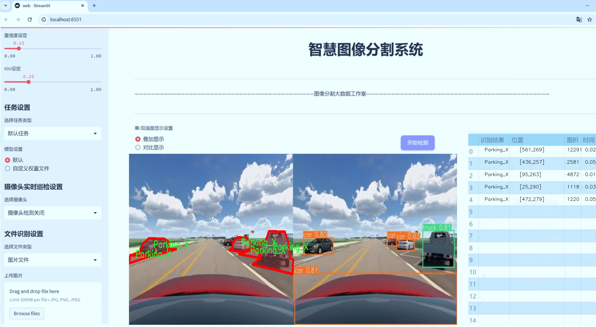
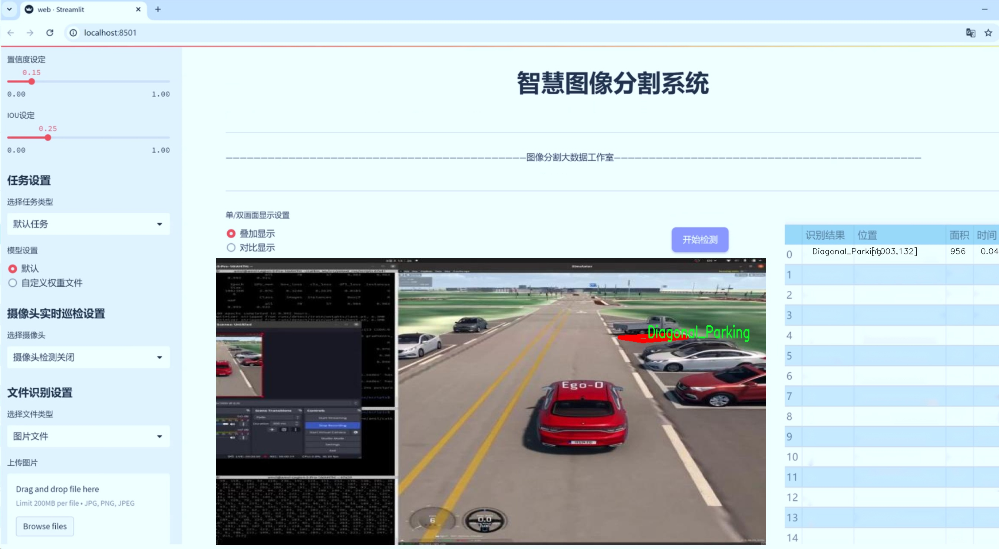
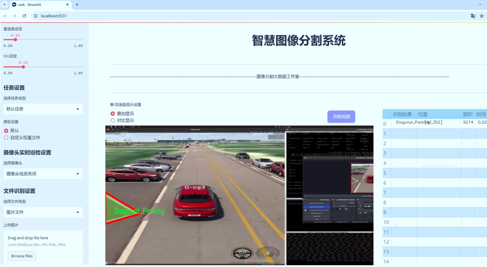
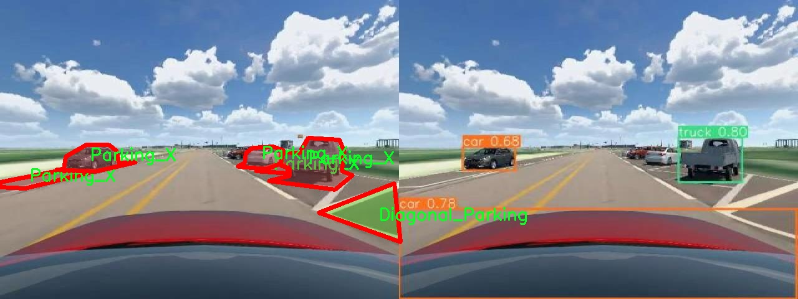
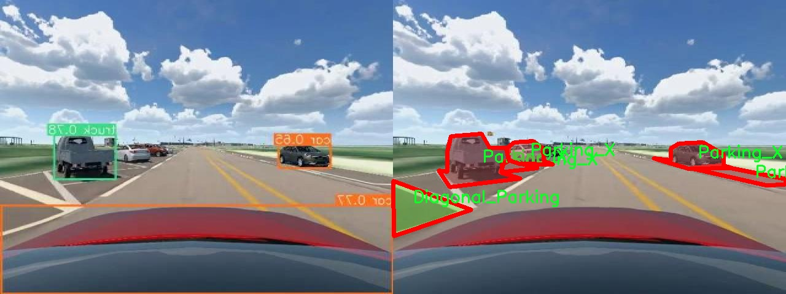
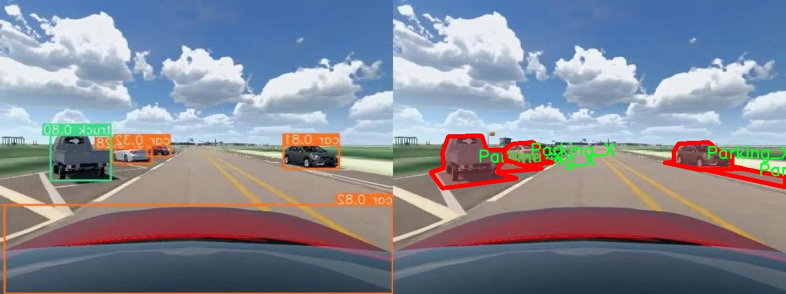
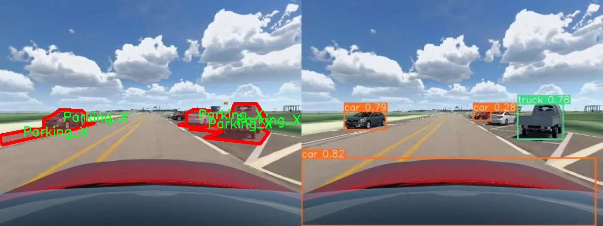
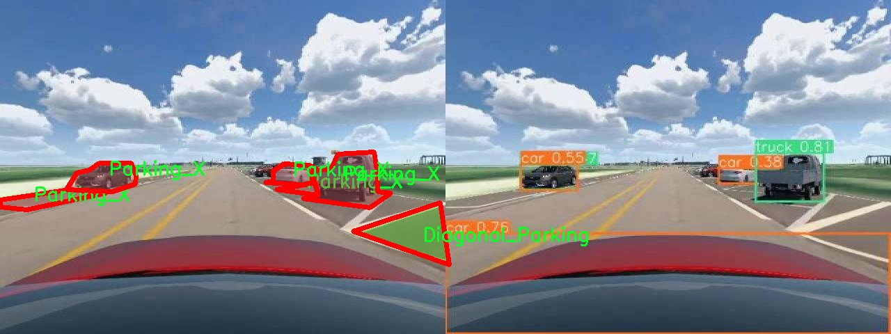

# 停车位类型分割系统源码＆数据集分享
 [yolov8-seg-aux＆yolov8-seg-C2f-DAttention等50+全套改进创新点发刊_一键训练教程_Web前端展示]

### 1.研究背景与意义

项目参考[ILSVRC ImageNet Large Scale Visual Recognition Challenge](https://gitee.com/YOLOv8_YOLOv11_Segmentation_Studio/projects)

项目来源[AAAI Global Al lnnovation Contest](https://kdocs.cn/l/cszuIiCKVNis)

研究背景与意义

随着城市化进程的加快，机动车数量的激增导致了停车难的问题日益严重。有效的停车管理不仅能够提高城市交通的流畅性，还能减少因寻找停车位而造成的环境污染和能源浪费。因此，开发一种高效的停车位检测与分类系统，能够为城市交通管理提供重要支持。近年来，深度学习技术的迅猛发展为计算机视觉领域带来了新的机遇，尤其是在目标检测和实例分割任务中，YOLO（You Only Look Once）系列模型因其高效性和准确性而备受关注。YOLOv8作为该系列的最新版本，具备了更强的特征提取能力和更快的推理速度，适合应用于实时的停车位检测与分类。

本研究旨在基于改进的YOLOv8模型，构建一个高效的停车位类型分割系统。该系统不仅能够识别停车位的存在与否，还能对不同类型的停车位进行精确分类，包括对角停车、平行停车、交叉停车和直角停车等四种类别。通过对2800幅图像的训练和测试，我们的系统将能够在复杂的城市环境中，准确地识别和分类停车位，从而为智能停车管理提供技术支持。

在数据集方面，我们使用了名为“0604_ALL”的模块，其中包含2800幅标注清晰的图像，涵盖了四种停车位类型。这些图像的多样性确保了模型在不同场景下的泛化能力。通过实例分割技术，我们不仅能够识别停车位的边界，还能提取出每种停车位的具体特征，为后续的停车管理决策提供依据。实例分割相较于传统的目标检测方法，能够提供更为精细的空间信息，这对于复杂的城市环境尤为重要。

本研究的意义在于，通过改进YOLOv8模型，提升停车位类型分割的准确性和实时性，能够为城市交通管理提供更为科学的数据支持。有效的停车位管理系统将有助于缓解城市交通压力，减少车辆在寻找停车位时的无效行驶，从而降低碳排放和能源消耗。此外，准确的停车位分类信息还可以为智能停车系统的开发提供基础数据，推动智能交通的发展。

综上所述，基于改进YOLOv8的停车位类型分割系统不仅具有重要的学术价值，也具备广泛的应用前景。通过本研究，我们希望能够为城市停车管理提供新的解决方案，为实现可持续发展的城市交通体系贡献力量。

### 2.图片演示







##### 注意：由于此博客编辑较早，上面“2.图片演示”和“3.视频演示”展示的系统图片或者视频可能为老版本，新版本在老版本的基础上升级如下：（实际效果以升级的新版本为准）

  （1）适配了YOLOV8的“目标检测”模型和“实例分割”模型，通过加载相应的权重（.pt）文件即可自适应加载模型。

  （2）支持“图片识别”、“视频识别”、“摄像头实时识别”三种识别模式。

  （3）支持“图片识别”、“视频识别”、“摄像头实时识别”三种识别结果保存导出，解决手动导出（容易卡顿出现爆内存）存在的问题，识别完自动保存结果并导出到tempDir中。

  （4）支持Web前端系统中的标题、背景图等自定义修改，后面提供修改教程。

  另外本项目提供训练的数据集和训练教程,暂不提供权重文件（best.pt）,需要您按照教程进行训练后实现图片演示和Web前端界面演示的效果。

### 3.视频演示

[3.1 视频演示](https://www.bilibili.com/video/BV1voDEY5EzE/)

### 4.数据集信息展示

##### 4.1 本项目数据集详细数据（类别数＆类别名）

nc: 3
names: ['Diagonal_Parking', 'Parallel_Parking', 'Parking_X']


##### 4.2 本项目数据集信息介绍

数据集信息展示

在本研究中，我们使用了名为“0604_ALL”的数据集，以支持对停车位类型的分割系统进行训练，旨在改进YOLOv8-seg模型的性能。该数据集专注于三种主要的停车位类型，分别是对角停车（Diagonal Parking）、平行停车（Parallel Parking）和交叉停车（Parking X）。通过对这些类别的细致标注和数据收集，我们能够为模型提供丰富的训练样本，从而提升其在实际应用中的准确性和鲁棒性。

“0604_ALL”数据集的构建过程充分考虑了停车位的多样性和复杂性。首先，在数据采集阶段，研究团队在多个城市的不同区域进行了实地拍摄，确保数据的多样性和代表性。所采集的图像涵盖了各种天气条件、光照变化和不同的交通环境，以模拟真实世界中可能遇到的情况。这种多样化的样本选择使得模型在训练过程中能够学习到更广泛的特征，从而提高其在实际应用中的适应能力。

数据集中的每一类停车位都经过精确的标注，以确保模型在训练时能够清晰地识别不同类型的停车位。对角停车的样本主要集中在城市街道和商业区，通常呈现出一定的倾斜角度，适合于在空间有限的环境中进行停车。平行停车则多见于居民区和商业中心，车辆通常沿着道路平行停放，标注时特别注意了车辆与路边的距离。交叉停车则是相对较少见的停车方式，通常出现在特定的停车场或临时停车区域，其标注要求对车辆的相对位置和方向进行细致的记录。

在数据集的标注过程中，研究团队采用了先进的图像标注工具，确保每个样本的准确性和一致性。通过多轮审核和验证，最终确定了数据集的高质量标准。这一过程不仅提高了数据集的可靠性，也为后续的模型训练奠定了坚实的基础。

“0604_ALL”数据集的设计理念是为了使模型能够在各种复杂的停车场景中进行有效的识别和分割。通过对不同停车位类型的深入学习，模型将能够在实际应用中实现高效的停车位管理和优化。这对于城市交通管理、智能停车系统的开发以及自动驾驶技术的推进都具有重要的意义。

总之，“0604_ALL”数据集为改进YOLOv8-seg的停车位类型分割系统提供了丰富的训练数据和坚实的基础。通过对三种停车位类型的深入分析和精确标注，该数据集不仅增强了模型的学习能力，也为未来的研究和应用提供了广阔的前景。随着数据集的不断完善和扩展，我们期待在停车位识别和管理领域取得更大的突破，为智能交通系统的发展贡献力量。











### 5.全套项目环境部署视频教程（零基础手把手教学）

[5.1 环境部署教程链接（零基础手把手教学）](https://www.bilibili.com/video/BV1jG4Ve4E9t/?vd_source=bc9aec86d164b67a7004b996143742dc)


[5.2 安装Python虚拟环境创建和依赖库安装视频教程链接（零基础手把手教学）](https://www.bilibili.com/video/BV1nA4VeYEze/?vd_source=bc9aec86d164b67a7004b996143742dc)

### 6.手把手YOLOV8-seg训练视频教程（零基础小白有手就能学会）

[6.1 手把手YOLOV8-seg训练视频教程（零基础小白有手就能学会）](https://www.bilibili.com/video/BV1cA4VeYETe/?vd_source=bc9aec86d164b67a7004b996143742dc)


按照上面的训练视频教程链接加载项目提供的数据集，运行train.py即可开始训练



     Epoch   gpu_mem       box       obj       cls    labels  img_size
     1/200     0G   0.01576   0.01955  0.007536        22      1280: 100%|██████████| 849/849 [14:42<00:00,  1.04s/it]
               Class     Images     Labels          P          R     mAP@.5 mAP@.5:.95: 100%|██████████| 213/213 [01:14<00:00,  2.87it/s]
                 all       3395      17314      0.994      0.957      0.0957      0.0843

     Epoch   gpu_mem       box       obj       cls    labels  img_size
     2/200     0G   0.01578   0.01923  0.007006        22      1280: 100%|██████████| 849/849 [14:44<00:00,  1.04s/it]
               Class     Images     Labels          P          R     mAP@.5 mAP@.5:.95: 100%|██████████| 213/213 [01:12<00:00,  2.95it/s]
                 all       3395      17314      0.996      0.956      0.0957      0.0845

     Epoch   gpu_mem       box       obj       cls    labels  img_size
     3/200     0G   0.01561    0.0191  0.006895        27      1280: 100%|██████████| 849/849 [10:56<00:00,  1.29it/s]
               Class     Images     Labels          P          R     mAP@.5 mAP@.5:.95: 100%|███████   | 187/213 [00:52<00:00,  4.04it/s]
                 all       3395      17314      0.996      0.957      0.0957      0.0845


### 7.50+种全套YOLOV8-seg创新点代码加载调参视频教程（一键加载写好的改进模型的配置文件）

[7.1 50+种全套YOLOV8-seg创新点代码加载调参视频教程（一键加载写好的改进模型的配置文件）](https://www.bilibili.com/video/BV1Hw4VePEXv/?vd_source=bc9aec86d164b67a7004b996143742dc)

### 8.YOLOV8-seg图像分割算法原理

原始YOLOv8-seg算法原理

YOLOv8-seg算法是YOLO系列中的最新进展，旨在实现高效的目标检测与分割。作为一种一阶段目标检测算法，YOLOv8-seg将目标检测与语义分割的任务结合在一起，形成了一种新颖的端到端解决方案。该算法的核心思想是通过深度学习模型直接从输入图像中提取特征，并在此基础上进行目标的定位与分割，从而实现对图像中各类目标的精确识别与分割。

YOLOv8-seg的网络结构由四个主要部分组成：输入层、主干网络、特征增强网络（neck）和检测头（head）。在输入层，算法对输入图像进行预处理，包括图像缩放、Mosaic数据增强和灰度填充等操作，以确保输入数据符合模型的要求。这些预处理步骤不仅提高了模型的鲁棒性，还有效增强了数据的多样性，使得模型在训练过程中能够学习到更丰富的特征。

主干网络是YOLOv8-seg的特征提取核心，采用了CSPNet（Cross Stage Partial Network）架构，通过卷积操作对输入图像进行下采样，提取出多层次的特征。每个卷积层后都配备了批归一化和SiLU激活函数，以加速收敛并提高模型的非线性表达能力。主干网络中的C2f模块借鉴了YOLOv7中的E-ELAN结构，通过跨层分支连接来增强模型的梯度流，从而改善检测结果。SPP（Spatial Pyramid Pooling）模块的引入，使得模型能够处理多尺度特征，进一步提升了特征的抽象能力。

特征增强网络采用了PAN-FPN（Path Aggregation Network - Feature Pyramid Network）结构，通过上采样和下采样的方式融合不同尺度的特征图。这一设计使得YOLOv8-seg能够更好地捕捉到目标的多尺度信息，尤其是在处理小目标时，能够有效提升模型的感知能力。特征增强网络不仅提高了特征的表达能力，还为后续的检测头提供了丰富的上下文信息，确保目标的准确定位。

检测头部分是YOLOv8-seg的关键创新之一。与传统的耦合检测头不同，YOLOv8-seg采用了解耦检测头，将目标的分类和回归任务分为两个独立的分支。这种解耦设计使得模型能够更加专注于各自的任务，从而有效解决了复杂场景下的定位不准和分类错误的问题。在解耦检测头中，YOLOv8-seg使用了Anchor-free的目标检测方法，直接通过回归方式预测目标的位置和大小，避免了传统方法中锚点框选择和调整的繁琐过程。这一创新不仅提升了检测精度，还加快了模型的推理速度，使得YOLOv8-seg能够在实时检测中表现出色。

YOLOv8-seg的损失函数设计也值得关注。模型在训练过程中采用了Task-Aligned Assigner方法，对分类分数和回归分数进行加权，以确保正样本的匹配更加准确。分类损失使用了二元交叉熵（BCE），而回归损失则采用了分布聚焦损失（DFL）和完全交并比（CIoU）损失函数。这种损失函数的组合有效提高了模型的泛化能力和精确度，使得YOLOv8-seg在各种复杂场景下均能保持良好的性能。

在实际应用中，YOLOv8-seg表现出了优越的实时检测能力和高精度的目标分割效果。尽管在复杂的水面环境中，由于小目标漂浮物特征复杂、背景多样，YOLOv8-seg仍可能面临定位误差和对目标感知能力不足的问题，但其基础架构的灵活性和高效性为后续的改进提供了广阔的空间。针对这些问题，研究者们提出了YOLOv8-WSSOD算法，通过引入BiFormer双层路由注意力机制和更小的检测头等手段，进一步提升了模型对小目标的感知能力和整体检测性能。

综上所述，YOLOv8-seg算法在YOLO系列中引入了多项创新设计，通过解耦检测头、Anchor-free方法和高效的特征融合策略，成功实现了目标检测与分割的高效结合。其优越的性能和灵活的架构使得YOLOv8-seg在实际应用中展现出广泛的前景，尤其是在需要实时处理和高精度识别的场景中，具有重要的应用价值。随着技术的不断进步，YOLOv8-seg及其衍生算法将继续推动目标检测与分割领域的发展，为智能视觉系统的构建提供强有力的支持。


### 9.系统功能展示（检测对象为举例，实际内容以本项目数据集为准）

图9.1.系统支持检测结果表格显示

  图9.2.系统支持置信度和IOU阈值手动调节

  图9.3.系统支持自定义加载权重文件best.pt(需要你通过步骤5中训练获得)

  图9.4.系统支持摄像头实时识别

  图9.5.系统支持图片识别

  图9.6.系统支持视频识别

  图9.7.系统支持识别结果文件自动保存

  图9.8.系统支持Excel导出检测结果数据


### 10.50+种全套YOLOV8-seg创新点原理讲解（非科班也可以轻松写刊发刊，V11版本正在科研待更新）

#### 10.1 由于篇幅限制，每个创新点的具体原理讲解就不一一展开，具体见下列网址中的创新点对应子项目的技术原理博客网址【Blog】：


[10.1 50+种全套YOLOV8-seg创新点原理讲解链接](https://gitee.com/qunmasj/good)

#### 10.2 部分改进模块原理讲解(完整的改进原理见上图和技术博客链接)【如果此小节的图加载失败可以通过CSDN或者Github搜索该博客的标题访问原始博客，原始博客图片显示正常】
### YOLOv8简介
YOLO（You Only Look Once）是一种流行的对象检测和图像分割模型，由华盛顿大学的Joseph Redmon和Ali Farhadi开发。YOLO于2015年推出，以其高速度和高精度迅速走红。

YOLOv2于2016年发布，通过合并批处理规范化、锚盒和维度集群来改进原始模型
2018年推出的YOLOv3使用更高效的骨干网络、多个锚点和空间金字塔池进一步增强了该模型的性能
YOLOv4于2020年发布，引入了Mosaic数据增强、新的无锚检测头和新的丢失功能等创新
YOLOv5进一步提高了模型的性能，并添加了超参数优化、集成实验跟踪和自动导出到流行导出格式等新功能
YOLOv6于2022年由美团开源，目前正在该公司的许多自动配送机器人中使用
YOLOv7在COCO关键点数据集上添加了额外的任务，如姿态估计
YOLOv8是Ultralytics公司推出的YOLO的最新版本。作为一款尖端、最先进的（SOTA）车型，YOLOv8在之前版本的成功基础上，引入了新的功能和改进，以增强性能、灵活性和效率。YOLOv8支持全方位的视觉AI任务，包括检测、分割、姿态估计、跟踪和分类。这种多功能性允许用户在不同的应用程序和域中利用YOLOv8的功能
#### YOLOv8的新特性与可用模型

Ultralytics 并没有直接将开源库命名为 YOLOv8，而是直接使用 ultralytics 这个词，原因是 ultralytics 将这个库定位为算法框架，而非某一个特定算法，一个主要特点是可扩展性。其希望这个库不仅仅能够用于 YOLO 系列模型，而是能够支持非 YOLO 模型以及分类分割姿态估计等各类任务。总而言之，ultralytics 开源库的两个主要优点是：

融合众多当前 SOTA 技术于一体
未来将支持其他 YOLO 系列以及 YOLO 之外的更多算法
Ultralytics为YOLO模型发布了一个全新的存储库。它被构建为 用于训练对象检测、实例分割和图像分类模型的统一框架。

提供了一个全新的 SOTA 模型，包括 P5 640 和 P6 1280 分辨率的目标检测网络和基于 YOLACT 的实例分割模型。和 YOLOv5 一样，基于缩放系数也提供了 N/S/M/L/X 尺度的不同大小模型，用于满足不同场景需求
骨干网络和 Neck 部分可能参考了 YOLOv7 ELAN 设计思想，将 YOLOv5 的 C3 结构换成了梯度流更丰富的 C2f 结构，并对不同尺度模型调整了不同的通道数，属于对模型结构精心微调，不再是无脑一套参数应用所有模型，大幅提升了模型性能。不过这个 C2f 模块中存在 Split 等操作对特定硬件部署没有之前那么友好了
Head 部分相比 YOLOv5 改动较大，换成了目前主流的解耦头结构，将分类和检测头分离，同时也从 Anchor-Based 换成了 Anchor-Free
Loss 计算方面采用了 TaskAlignedAssigner 正样本分配策略，并引入了 Distribution Focal Loss
训练的数据增强部分引入了 YOLOX 中的最后 10 epoch 关闭 Mosiac 增强的操作，可以有效地提升精度
YOLOv8 还高效灵活地支持多种导出格式，并且该模型可以在 CPU 和 GPU 上运行。YOLOv8 模型的每个类别中有五个模型用于检测、分割和分类。YOLOv8 Nano 是最快和最小的，而 YOLOv8 Extra Large (YOLOv8x) 是其中最准确但最慢的。


### FocalModulation模型的基本原理
参考该博客，Focal Modulation Networks（FocalNets）的基本原理是替换自注意力（Self-Attention）模块，使用焦点调制（focal modulation）机制来捕捉图像中的长距离依赖和上下文信息。下图是自注意力和焦点调制两种方法的对比。


自注意力要求对每个查询令牌（Query Token）与其他令牌进行复杂的查询-键（Query-Key）交互和查询-值（Query-Value）聚合，以计算注意力分数并捕捉上下文。而焦点调制则先将空间上下文以不同粒度聚合到调制器中，然后以查询依赖的方式将这些调制器注入到查询令牌中。焦点调制简化了交互和聚合操作，使其更轻量级。在图中，自注意力部分使用红色虚线表示查询-键交互和黄色虚线表示查询-值聚合，而焦点调制部分则用蓝色表示调制器聚合和黄色表示查询-调制器交互。 

FocalModulation模型通过以下步骤实现：

1. 焦点上下文化：用深度卷积层堆叠来编码不同范围的视觉上下文。


2. 门控聚合：通过门控机制，选择性地将上下文信息聚合到每个查询令牌的调制器中。


3. 逐元素仿射变换：将聚合后的调制器通过仿射变换注入到每个查询令牌中。

下面来分别介绍这三个机制->

#### 焦点上下文化
焦点上下文化（Focal Contextualization）是焦点调制（Focal Modulation）的一个组成部分。焦点上下文化使用一系列深度卷积层（depth-wise convolutional layers）来编码不同范围内的视觉上下文信息。这些层可以捕捉从近处到远处的视觉特征，从而允许网络在不同层次上理解图像内容。通过这种方式，网络能够在聚合上下文信息时保持对局部细节的敏感性，并增强对全局结构的认识。


​

这张图详细比较了自注意力（Self-Attention, SA）和焦点调制（Focal Modulation）的机制，并特别展示了焦点调制中的上下文聚合过程。左侧的图展示了自注意力模型如何通过键（k）和查询（q）之间的交互，以及随后的聚合来生成输出。而中间和右侧的图说明了焦点调制如何通过层级化的上下文聚合和门控聚合过程替代自注意力模型的这一过程。在焦点调制中，输入首先通过轻量级线性层进行处理，然后通过层级化的上下文化模块和门控机制来选择性地聚合信息，最终通过调制器与查询（q）进行交互以生成输出。

#### 门控聚合
在Focal Modulation Networks（FocalNets）中的 "门控聚合"（Gated Aggregation）是关键组件之一，这一过程涉及使用门控机制来选择性地聚合上下文信息。以下是这个过程的详细分析：

1. 什么是门控机制？
门控机制在深度学习中常用于控制信息流。它通常用于决定哪些信息应该被传递，哪些应该被阻断。在循环神经网络（RNN）中，特别是在长短期记忆网络（LSTM）和门控循环单元（GRU）中，门控机制用于调节信息在时间序列数据中的流动。

2. 门控聚合的目的
在FocalNets中，门控聚合的目的是为每个查询令牌（即处理中的数据单元）选择性地聚合上下文信息。这意味着网络能够决定哪些特定的上下文信息对于当前处理的查询令牌是重要的，从而专注于那些最相关的信息。

3. 如何实现门控聚合？
实现门控聚合可能涉及一系列计算步骤，其中包括：

计算上下文信息：这可能涉及使用深度卷积层（如文中提到的）对输入图像的不同区域进行编码，以捕捉从局部到全局的视觉上下文。
门控操作：这一步骤涉及到一个决策过程，根据当前查询令牌的特征来决定哪些上下文信息是相关的。这可能通过一个学习到的权重（门）来实现，该权重决定了不同上下文信息的重要性。
信息聚合：最后，根据门控操作的结果，选择性地聚合上下文信息到一个调制器中。这个调制器随后被用于调整或“调制”查询令牌的表示。
4. 门控聚合的好处
通过门控聚合，FocalNets能够更有效地聚焦于对当前任务最关键的信息。这种方法提高了模型的效率和性能，因为它减少了不必要信息的处理，同时增强了对关键特征的关注。在视觉任务中，这可能意味着更好的目标检测和图像分类性能，特别是在复杂或多变的视觉环境中。

总结：门控聚合是FocalNets的一个核心组成部分，它通过选择性地集中处理重要的上下文信息来提升网络的效率和性能。

#### 逐元素仿射变换
在Focal Modulation Networks（FocalNets）中的第三个关键组件是逐元素仿射变换，这个步骤涉及将通过门控聚合得到的调制器注入到每个查询令牌中。以下是该过程的详细分析：

1. 仿射变换的基本概念：
仿射变换是一种线性变换，用于对数据进行缩放、旋转、平移和倾斜等操作。在深度学习中，逐元素的仿射变换通常指的是对每个元素进行线性变换，这种变换可以被描述为y = ax + b，其中x是输入，y是输出，a和b是变换的参数。

2. 逐元素仿射变换的作用：
在FocalNets中，逐元素仿射变换的作用是将聚合后的调制器信息注入到每个查询令牌中。这个步骤对于整合上下文信息和查询令牌的原始特征非常重要。通过这种方式，调制器所包含的上下文信息可以直接影响查询令牌的表示。

3. 执行仿射变换：
执行这一步骤时，聚合后的调制器对每个查询令牌进行逐元素的仿射变换。在实践中，这可能意味着对查询令牌的每个特征应用调制器中的相应权重（a）和偏差（b）。这样，调制器中的每个元素都直接对应于查询令牌的一个特征，通过调整这些特征来改变其表达。

4. 仿射变换的效果：
通过逐元素仿射变换，模型能够更细致地调整每个查询令牌的特征，根据上下文信息来增强或抑制某些特征。这种精细的调整机制允许网络更好地适应复杂的视觉场景，提高对细节的捕捉能力，从而提升了模型在各种视觉任务中的性能，如目标检测和图像分类。

总结：逐元素仿射变换它使得模型能够利用上下文信息来有效地调整查询令牌，增强了模型对关键视觉特征的捕捉和表达能力。


### 11.项目核心源码讲解（再也不用担心看不懂代码逻辑）

#### 11.1 ultralytics\models\yolo\classify\train.py

以下是对代码的核心部分进行的分析和详细注释：

```python
# 导入必要的库
import torch
import torchvision

# 从Ultralytics库中导入相关模块
from ultralytics.data import ClassificationDataset, build_dataloader
from ultralytics.engine.trainer import BaseTrainer
from ultralytics.models import yolo
from ultralytics.nn.tasks import ClassificationModel, attempt_load_one_weight
from ultralytics.utils import DEFAULT_CFG, LOGGER, RANK, colorstr
from ultralytics.utils.plotting import plot_images, plot_results
from ultralytics.utils.torch_utils import is_parallel, strip_optimizer, torch_distributed_zero_first

class ClassificationTrainer(BaseTrainer):
    """
    继承自BaseTrainer类的分类训练器，用于基于分类模型的训练。
    """

    def __init__(self, cfg=DEFAULT_CFG, overrides=None, _callbacks=None):
        """初始化ClassificationTrainer对象，支持配置覆盖和回调函数。"""
        if overrides is None:
            overrides = {}
        overrides['task'] = 'classify'  # 设置任务类型为分类
        if overrides.get('imgsz') is None:
            overrides['imgsz'] = 224  # 默认图像大小为224
        super().__init__(cfg, overrides, _callbacks)  # 调用父类构造函数

    def set_model_attributes(self):
        """从加载的数据集中设置YOLO模型的类名。"""
        self.model.names = self.data['names']

    def get_model(self, cfg=None, weights=None, verbose=True):
        """返回配置为训练YOLO的修改后的PyTorch模型。"""
        model = ClassificationModel(cfg, nc=self.data['nc'], verbose=verbose and RANK == -1)
        if weights:
            model.load(weights)  # 加载权重

        # 遍历模型的每一层，进行参数初始化
        for m in model.modules():
            if not self.args.pretrained and hasattr(m, 'reset_parameters'):
                m.reset_parameters()  # 重置参数
            if isinstance(m, torch.nn.Dropout) and self.args.dropout:
                m.p = self.args.dropout  # 设置dropout概率
        for p in model.parameters():
            p.requires_grad = True  # 设置为可训练
        return model

    def setup_model(self):
        """加载、创建或下载模型以进行任何任务。"""
        if isinstance(self.model, torch.nn.Module):  # 如果模型已经加载，无需设置
            return

        model, ckpt = str(self.model), None
        # 根据模型名称加载YOLO模型
        if model.endswith('.pt'):
            self.model, ckpt = attempt_load_one_weight(model, device='cpu')  # 从本地加载权重
            for p in self.model.parameters():
                p.requires_grad = True  # 设置为可训练
        elif model.split('.')[-1] in ('yaml', 'yml'):
            self.model = self.get_model(cfg=model)  # 从配置文件加载模型
        elif model in torchvision.models.__dict__:
            self.model = torchvision.models.__dict__[model](weights='IMAGENET1K_V1' if self.args.pretrained else None)  # 从torchvision加载模型
        else:
            raise FileNotFoundError(f'ERROR: model={model} not found locally or online. Please check model name.')
        ClassificationModel.reshape_outputs(self.model, self.data['nc'])  # 重塑模型输出

    def build_dataset(self, img_path, mode='train', batch=None):
        """根据图像路径和模式（训练/测试等）创建ClassificationDataset实例。"""
        return ClassificationDataset(root=img_path, args=self.args, augment=mode == 'train', prefix=mode)

    def get_dataloader(self, dataset_path, batch_size=16, rank=0, mode='train'):
        """返回用于推理的PyTorch DataLoader，并对图像进行预处理。"""
        with torch_distributed_zero_first(rank):  # 在分布式环境中只初始化一次数据集
            dataset = self.build_dataset(dataset_path, mode)

        loader = build_dataloader(dataset, batch_size, self.args.workers, rank=rank)  # 构建数据加载器
        # 附加推理变换
        if mode != 'train':
            if is_parallel(self.model):
                self.model.module.transforms = loader.dataset.torch_transforms
            else:
                self.model.transforms = loader.dataset.torch_transforms
        return loader

    def preprocess_batch(self, batch):
        """预处理一批图像和类别。"""
        batch['img'] = batch['img'].to(self.device)  # 将图像转移到设备上
        batch['cls'] = batch['cls'].to(self.device)  # 将类别转移到设备上
        return batch

    def get_validator(self):
        """返回ClassificationValidator实例以进行验证。"""
        self.loss_names = ['loss']  # 定义损失名称
        return yolo.classify.ClassificationValidator(self.test_loader, self.save_dir)  # 返回验证器

    def final_eval(self):
        """评估训练后的模型并保存验证结果。"""
        for f in self.last, self.best:
            if f.exists():
                strip_optimizer(f)  # 去除优化器信息
                if f is self.best:
                    LOGGER.info(f'\nValidating {f}...')
                    self.validator.args.data = self.args.data
                    self.validator.args.plots = self.args.plots
                    self.metrics = self.validator(model=f)  # 进行验证
                    self.metrics.pop('fitness', None)  # 移除不需要的指标
        LOGGER.info(f"Results saved to {colorstr('bold', self.save_dir)}")  # 打印结果保存路径
```

### 核心部分分析：
1. **类定义**：`ClassificationTrainer`类继承自`BaseTrainer`，用于处理分类任务的训练。
2. **初始化方法**：在构造函数中设置任务类型、图像大小等参数，并调用父类的构造函数。
3. **模型设置**：通过`get_model`和`setup_model`方法加载和配置模型，支持从本地、torchvision或Ultralytics资产加载模型。
4. **数据集和数据加载器**：`build_dataset`和`get_dataloader`方法用于创建数据集和数据加载器，支持数据增强和分布式训练。
5. **模型验证**：`get_validator`和`final_eval`方法用于模型的验证和评估，确保训练过程中的性能监控。

以上是对代码的核心部分的分析和详细注释，帮助理解其功能和实现逻辑。

这个文件是Ultralytics YOLO框架中的一个分类训练模块，主要用于训练基于YOLO模型的图像分类任务。代码中定义了一个名为`ClassificationTrainer`的类，它继承自`BaseTrainer`类，专门处理分类模型的训练过程。

在类的初始化方法中，首先设置了一些默认参数，比如任务类型为分类，图像大小默认为224。如果用户提供了覆盖参数，这些参数将被应用。接着，调用父类的初始化方法来完成其他设置。

`set_model_attributes`方法用于从加载的数据集中设置YOLO模型的类名，以便在训练过程中能够正确识别不同的类别。

`get_model`方法用于返回一个配置好的PyTorch模型，适用于YOLO的训练。如果用户提供了权重文件，该方法会加载这些权重。它还会遍历模型的每一层，重置参数和设置dropout率，以便进行训练。

`setup_model`方法负责加载、创建或下载模型。如果模型已经被加载，则不需要再次设置。该方法支持从本地文件、Torchvision模型库或Ultralytics资源中加载YOLO模型，并确保模型的输出形状与数据集的类别数相匹配。

`build_dataset`方法根据给定的图像路径和模式（训练或测试）创建一个`ClassificationDataset`实例，以便后续的数据处理。

`get_dataloader`方法返回一个PyTorch的DataLoader，用于在推理时对图像进行预处理。它会在分布式训练的情况下确保数据集只初始化一次。

`preprocess_batch`方法用于处理一批图像和类别数据，将它们移动到指定的设备上（如GPU）。

`progress_string`方法返回一个格式化的字符串，显示训练进度，包括当前的epoch、GPU内存使用情况和损失值等信息。

`get_validator`方法返回一个分类验证器的实例，用于在训练过程中进行模型验证。

`label_loss_items`方法返回一个带有标签的损失字典，尽管对于分类任务来说，这个方法并不是必需的，但在其他任务（如分割和检测）中可能会用到。

`plot_metrics`方法用于从CSV文件中绘制训练过程中的指标，并保存结果图像。

`final_eval`方法在训练结束后评估训练好的模型，并保存验证结果。它会处理最后一次和最佳模型的优化器，并在验证时记录结果。

最后，`plot_training_samples`方法用于绘制训练样本及其注释，便于可视化训练过程中的数据。

总体来说，这个文件实现了YOLO模型在图像分类任务中的训练逻辑，涵盖了模型设置、数据处理、训练过程管理和结果评估等多个方面。

#### 11.2 ultralytics\utils\callbacks\base.py

以下是代码中最核心的部分，并附上详细的中文注释：

```python
from collections import defaultdict
from copy import deepcopy

# 默认回调函数字典，包含训练、验证、预测和导出过程中的回调函数
default_callbacks = {
    # 训练过程中的回调
    'on_train_start': [lambda trainer: print("训练开始")],
    'on_train_epoch_start': [lambda trainer: print("训练轮次开始")],
    'on_train_batch_start': [lambda trainer: print("训练批次开始")],
    'on_train_batch_end': [lambda trainer: print("训练批次结束")],
    'on_train_epoch_end': [lambda trainer: print("训练轮次结束")],
    'on_train_end': [lambda trainer: print("训练结束")],

    # 验证过程中的回调
    'on_val_start': [lambda validator: print("验证开始")],
    'on_val_batch_start': [lambda validator: print("验证批次开始")],
    'on_val_batch_end': [lambda validator: print("验证批次结束")],
    'on_val_end': [lambda validator: print("验证结束")],

    # 预测过程中的回调
    'on_predict_start': [lambda predictor: print("预测开始")],
    'on_predict_batch_start': [lambda predictor: print("预测批次开始")],
    'on_predict_batch_end': [lambda predictor: print("预测批次结束")],
    'on_predict_end': [lambda predictor: print("预测结束")],

    # 导出过程中的回调
    'on_export_start': [lambda exporter: print("导出开始")],
    'on_export_end': [lambda exporter: print("导出结束")]
}

def get_default_callbacks():
    """
    返回一个包含默认回调函数的字典副本，字典的值为默认空列表。

    返回:
        (defaultdict): 一个defaultdict，包含default_callbacks中的键和空列表作为默认值。
    """
    return defaultdict(list, deepcopy(default_callbacks))

def add_integration_callbacks(instance):
    """
    从各种来源向实例的回调中添加集成回调。

    参数:
        instance (Trainer, Predictor, Validator, Exporter): 一个具有'callbacks'属性的对象，该属性是一个回调列表的字典。
    """
    # 加载HUB回调
    from .hub import callbacks as hub_cb
    callbacks_list = [hub_cb]

    # 如果实例是Trainer类型，加载其他训练回调
    if 'Trainer' in instance.__class__.__name__:
        from .clearml import callbacks as clear_cb
        from .comet import callbacks as comet_cb
        from .dvc import callbacks as dvc_cb
        from .mlflow import callbacks as mlflow_cb
        from .neptune import callbacks as neptune_cb
        from .raytune import callbacks as tune_cb
        from .tensorboard import callbacks as tb_cb
        from .wb import callbacks as wb_cb
        callbacks_list.extend([clear_cb, comet_cb, dvc_cb, mlflow_cb, neptune_cb, tune_cb, tb_cb, wb_cb])

    # 将回调添加到实例的回调字典中
    for callbacks in callbacks_list:
        for k, v in callbacks.items():
            if v not in instance.callbacks[k]:
                instance.callbacks[k].append(v)
```

### 代码说明：
1. **default_callbacks**: 这是一个字典，定义了在训练、验证、预测和导出过程中可以调用的回调函数。每个回调函数都可以在特定事件发生时被调用，例如训练开始、训练结束等。

2. **get_default_callbacks**: 这个函数返回一个包含默认回调函数的字典副本，使用`defaultdict`来确保每个键都有一个空列表作为默认值。

3. **add_integration_callbacks**: 这个函数用于将集成回调添加到给定实例的回调字典中。它首先加载HUB回调，然后根据实例的类型（如Trainer）加载其他相关的回调，并将它们添加到实例的回调列表中。

这个程序文件是Ultralytics YOLO框架中的一个回调函数基础模块，主要用于在训练、验证、预测和导出模型的不同阶段执行特定的操作。文件中定义了一系列的回调函数，这些函数在不同的训练和验证过程中被调用，以便在特定事件发生时执行相应的逻辑。

文件首先导入了`defaultdict`和`deepcopy`，这两个模块分别用于创建一个带有默认值的字典和深拷贝对象。接下来，文件中定义了一系列的回调函数，分为四个主要部分：训练回调、验证回调、预测回调和导出回调。

在训练回调部分，定义了多个函数，如`on_train_start`、`on_train_epoch_start`、`on_train_batch_start`等。这些函数在训练的不同阶段被调用，例如在训练开始时、每个训练周期开始时、每个训练批次开始时等。每个函数目前都只是一个占位符，实际逻辑需要在使用时实现。

验证回调部分同样定义了一些函数，如`on_val_start`、`on_val_batch_start`等，用于在验证过程的不同阶段执行操作。

预测回调部分则包含了在预测开始、每个预测批次开始和结束时的回调函数。

导出回调部分则定义了在模型导出开始和结束时的回调函数。

在文件的最后，定义了一个`default_callbacks`字典，汇总了所有的回调函数，并将它们按不同的阶段分类。`get_default_callbacks`函数返回一个带有默认值的`defaultdict`，用于提供这些回调函数的副本。

此外，`add_integration_callbacks`函数用于将来自不同来源的集成回调添加到实例的回调字典中。这个函数会根据传入的实例类型（如Trainer、Predictor等）加载相应的回调，并将它们添加到实例的回调列表中。

总体来说，这个文件为Ultralytics YOLO框架提供了一个灵活的回调机制，使得用户可以在训练、验证、预测和导出模型的过程中自定义行为，以满足不同的需求。

#### 11.3 ultralytics\models\yolo\pose\val.py

以下是经过简化和注释的核心代码部分：

```python
# 导入必要的库
from pathlib import Path
import numpy as np
import torch
from ultralytics.models.yolo.detect import DetectionValidator
from ultralytics.utils import ops

class PoseValidator(DetectionValidator):
    """
    PoseValidator类用于基于姿态模型的验证，继承自DetectionValidator类。
    """

    def __init__(self, dataloader=None, save_dir=None, pbar=None, args=None, _callbacks=None):
        """初始化PoseValidator对象，设置参数和属性。"""
        super().__init__(dataloader, save_dir, pbar, args, _callbacks)
        self.sigma = None  # 用于计算关键点的标准差
        self.kpt_shape = None  # 关键点的形状
        self.args.task = 'pose'  # 设置任务类型为姿态估计
        # 初始化姿态度量
        self.metrics = PoseMetrics(save_dir=self.save_dir, on_plot=self.on_plot)

    def preprocess(self, batch):
        """对批次数据进行预处理，将关键点数据转换为浮点数并移动到设备上。"""
        batch = super().preprocess(batch)  # 调用父类的预处理方法
        batch['keypoints'] = batch['keypoints'].to(self.device).float()  # 转换关键点数据类型
        return batch

    def postprocess(self, preds):
        """应用非极大值抑制，返回高置信度的检测结果。"""
        return ops.non_max_suppression(preds,
                                       self.args.conf,
                                       self.args.iou,
                                       labels=self.lb,
                                       multi_label=True,
                                       agnostic=self.args.single_cls,
                                       max_det=self.args.max_det,
                                       nc=self.nc)

    def init_metrics(self, model):
        """初始化YOLO模型的姿态估计度量。"""
        super().init_metrics(model)  # 调用父类的初始化方法
        self.kpt_shape = self.data['kpt_shape']  # 获取关键点形状
        is_pose = self.kpt_shape == [17, 3]  # 判断是否为姿态模型
        nkpt = self.kpt_shape[0]  # 关键点数量
        self.sigma = OKS_SIGMA if is_pose else np.ones(nkpt) / nkpt  # 设置标准差

    def update_metrics(self, preds, batch):
        """更新度量数据。"""
        for si, pred in enumerate(preds):  # 遍历每个预测结果
            idx = batch['batch_idx'] == si  # 获取当前批次索引
            cls = batch['cls'][idx]  # 获取当前批次的类别
            bbox = batch['bboxes'][idx]  # 获取当前批次的边界框
            kpts = batch['keypoints'][idx]  # 获取当前批次的关键点
            npr = pred.shape[0]  # 当前预测数量
            shape = batch['ori_shape'][si]  # 原始图像形状
            correct_kpts = torch.zeros(npr, self.niou, dtype=torch.bool, device=self.device)  # 初始化关键点正确标记
            correct_bboxes = torch.zeros(npr, self.niou, dtype=torch.bool, device=self.device)  # 初始化边界框正确标记

            if npr == 0:  # 如果没有预测结果
                continue  # 跳过当前循环

            # 处理预测结果
            predn = pred.clone()  # 克隆预测结果
            ops.scale_boxes(batch['img'][si].shape[1:], predn[:, :4], shape,
                            ratio_pad=batch['ratio_pad'][si])  # 缩放边界框
            pred_kpts = predn[:, 6:].view(npr, -1, 3)  # 处理关键点

            # 评估
            if cls.shape[0]:  # 如果有真实标签
                # 处理真实边界框和关键点
                correct_bboxes = self._process_batch(predn[:, :6], labelsn)  # 处理边界框
                correct_kpts = self._process_batch(predn[:, :6], labelsn, pred_kpts, tkpts)  # 处理关键点

            # 更新统计数据
            self.stats.append((correct_bboxes, correct_kpts, pred[:, 4], pred[:, 5], cls.squeeze(-1)))

    def _process_batch(self, detections, labels, pred_kpts=None, gt_kpts=None):
        """
        返回正确的预测矩阵。
        """
        if pred_kpts is not None and gt_kpts is not None:
            # 计算关键点的IoU
            iou = kpt_iou(gt_kpts, pred_kpts, sigma=self.sigma)
        else:  # 计算边界框的IoU
            iou = box_iou(labels[:, 1:], detections[:, :4])

        return self.match_predictions(detections[:, 5], labels[:, 0], iou)  # 匹配预测结果

    def plot_val_samples(self, batch, ni):
        """绘制并保存验证集样本，包含预测的边界框和关键点。"""
        plot_images(batch['img'],
                    batch['batch_idx'],
                    batch['cls'].squeeze(-1),
                    batch['bboxes'],
                    kpts=batch['keypoints'],
                    paths=batch['im_file'],
                    fname=self.save_dir / f'val_batch{ni}_labels.jpg',
                    names=self.names)

    def pred_to_json(self, predn, filename):
        """将YOLO预测结果转换为COCO JSON格式。"""
        stem = Path(filename).stem
        box = ops.xyxy2xywh(predn[:, :4])  # 转换为xywh格式
        box[:, :2] -= box[:, 2:] / 2  # 将中心点转换为左上角
        for p, b in zip(predn.tolist(), box.tolist()):
            self.jdict.append({
                'image_id': int(stem),
                'category_id': self.class_map[int(p[5])],
                'bbox': [round(x, 3) for x in b],
                'keypoints': p[6:],
                'score': round(p[4], 5)})

    def eval_json(self, stats):
        """使用COCO JSON格式评估目标检测模型。"""
        if self.args.save_json and self.is_coco and len(self.jdict):
            # 评估逻辑...
            pass  # 省略具体实现
        return stats
```

### 代码说明：
1. **PoseValidator类**：继承自`DetectionValidator`，用于姿态估计的验证。
2. **初始化方法**：设置相关参数和属性，初始化姿态度量。
3. **预处理方法**：将批次数据中的关键点转换为浮点数并移动到指定设备。
4. **后处理方法**：应用非极大值抑制，筛选出高置信度的检测结果。
5. **更新度量方法**：根据预测结果和真实标签更新统计数据。
6. **绘制验证样本**：将验证集样本及其预测结果绘制并保存。
7. **预测结果转换**：将YOLO的预测结果转换为COCO格式的JSON文件。
8. **评估方法**：使用COCO格式的JSON文件评估模型性能。

这个程序文件是一个用于验证姿态估计模型的类，名为`PoseValidator`，它继承自`DetectionValidator`类。该类主要用于在YOLO（You Only Look Once）模型上进行姿态估计的验证工作。

在初始化方法中，`PoseValidator`接收多个参数，包括数据加载器、保存目录、进度条、参数和回调函数。它调用父类的初始化方法，并设置一些特定于姿态估计的属性，如`self.sigma`和`self.kpt_shape`。此外，它还会检查设备类型，如果设备是Apple的MPS（Metal Performance Shaders），则会发出警告，建议使用CPU进行姿态模型的计算。

`preprocess`方法用于对输入的批次数据进行预处理，将关键点数据转换为浮点数并移动到指定设备上。`get_desc`方法返回评估指标的描述信息，以便在输出时使用。

在`postprocess`方法中，应用非最大抑制（NMS）来过滤掉低置信度的检测结果。`init_metrics`方法用于初始化姿态估计的指标，包括设置关键点的形状和计算`self.sigma`的值。

`update_metrics`方法是核心部分，它用于更新模型的评估指标。该方法会遍历每个预测结果，并根据真实标签计算正确的关键点和边界框。它还会处理预测结果的缩放和坐标转换，以确保在不同的图像尺寸下能够正确评估。

`_process_batch`方法用于返回正确的预测矩阵，它根据检测结果和标签计算IoU（Intersection over Union），并返回匹配的预测结果。`plot_val_samples`和`plot_predictions`方法用于可视化验证样本和模型的预测结果，生成带有边界框和关键点的图像。

`pred_to_json`方法将YOLO的预测结果转换为COCO格式的JSON，以便于后续的评估和分析。`eval_json`方法则用于评估模型的性能，利用pycocotools库计算mAP（mean Average Precision）指标，支持使用COCO格式的标注数据进行评估。

整体而言，这个文件实现了姿态估计模型的验证流程，包括数据预处理、指标计算、结果可视化和性能评估等功能。

#### 11.4 ultralytics\nn\backbone\CSwomTramsformer.py

以下是经过简化和注释的核心代码部分：

```python
import torch
import torch.nn as nn
import numpy as np

class Mlp(nn.Module):
    """多层感知机（MLP）模块"""
    def __init__(self, in_features, hidden_features=None, out_features=None, act_layer=nn.GELU, drop=0.):
        super().__init__()
        out_features = out_features or in_features  # 输出特征数
        hidden_features = hidden_features or in_features  # 隐藏层特征数
        self.fc1 = nn.Linear(in_features, hidden_features)  # 第一层线性变换
        self.act = act_layer()  # 激活函数
        self.fc2 = nn.Linear(hidden_features, out_features)  # 第二层线性变换
        self.drop = nn.Dropout(drop)  # Dropout层

    def forward(self, x):
        """前向传播"""
        x = self.fc1(x)  # 线性变换
        x = self.act(x)  # 激活
        x = self.drop(x)  # Dropout
        x = self.fc2(x)  # 线性变换
        x = self.drop(x)  # Dropout
        return x

class CSWinBlock(nn.Module):
    """CSWin Transformer的基本块"""
    def __init__(self, dim, num_heads, mlp_ratio=4., drop=0., attn_drop=0., norm_layer=nn.LayerNorm):
        super().__init__()
        self.dim = dim  # 输入特征维度
        self.num_heads = num_heads  # 注意力头数
        self.norm1 = norm_layer(dim)  # 归一化层
        self.qkv = nn.Linear(dim, dim * 3)  # 线性变换生成Q、K、V

        # 注意力机制
        self.attn = LePEAttention(dim, num_heads=num_heads, attn_drop=attn_drop)

        # MLP模块
        self.mlp = Mlp(in_features=dim, hidden_features=int(dim * mlp_ratio), out_features=dim, drop=drop)
        self.norm2 = norm_layer(dim)  # 归一化层

    def forward(self, x):
        """前向传播"""
        x = self.norm1(x)  # 归一化
        qkv = self.qkv(x).reshape(x.shape[0], -1, 3, self.dim).permute(2, 0, 1, 3)  # 生成Q、K、V
        x = self.attn(qkv)  # 注意力计算
        x = x + self.mlp(self.norm2(x))  # 加上MLP的输出
        return x

class CSWinTransformer(nn.Module):
    """CSWin Transformer模型"""
    def __init__(self, img_size=640, in_chans=3, num_classes=1000, embed_dim=96, depth=[2, 2, 6, 2], num_heads=12):
        super().__init__()
        self.num_classes = num_classes
        self.embed_dim = embed_dim  # 嵌入维度

        # 输入层
        self.stage1_conv_embed = nn.Sequential(
            nn.Conv2d(in_chans, embed_dim, kernel_size=7, stride=4, padding=2),
            nn.LayerNorm(embed_dim)
        )

        # 各个阶段的CSWinBlock
        self.stage1 = nn.ModuleList([CSWinBlock(dim=embed_dim, num_heads=num_heads) for _ in range(depth[0])])
        self.stage2 = nn.ModuleList([CSWinBlock(dim=embed_dim * 2, num_heads=num_heads * 2) for _ in range(depth[1])])
        self.stage3 = nn.ModuleList([CSWinBlock(dim=embed_dim * 4, num_heads=num_heads * 4) for _ in range(depth[2])])
        self.stage4 = nn.ModuleList([CSWinBlock(dim=embed_dim * 8, num_heads=num_heads * 8) for _ in range(depth[3])])

    def forward(self, x):
        """前向传播"""
        x = self.stage1_conv_embed(x)  # 输入层处理
        for blk in self.stage1:
            x = blk(x)  # 逐层通过CSWinBlock
        for blk in self.stage2:
            x = blk(x)
        for blk in self.stage3:
            x = blk(x)
        for blk in self.stage4:
            x = blk(x)
        return x

# 示例代码：创建模型并进行前向传播
if __name__ == '__main__':
    inputs = torch.randn((1, 3, 640, 640))  # 输入张量
    model = CSWinTransformer()  # 创建CSWin Transformer模型
    res = model(inputs)  # 前向传播
    print(res.size())  # 输出结果的尺寸
```

### 代码说明：
1. **Mlp类**：实现了一个多层感知机（MLP），包含两个线性层和一个激活函数。支持Dropout。
2. **CSWinBlock类**：构建了CSWin Transformer的基本模块，包含归一化、注意力机制和MLP。
3. **CSWinTransformer类**：定义了整个CSWin Transformer模型，包含输入层和多个CSWinBlock的堆叠。
4. **前向传播**：在`forward`方法中，输入经过各个阶段的处理，最终输出特征。

这段代码保留了CSWin Transformer的核心结构，并添加了详细的中文注释，便于理解每个部分的功能。

这个程序文件实现了CSWin Transformer模型，这是一个用于计算机视觉任务的深度学习模型。文件的结构包括多个类和函数，每个部分都承担着特定的功能。

首先，文件导入了必要的库，包括PyTorch和一些用于模型构建的辅助库。接着，定义了几个模型的基本组件，比如多层感知机（Mlp）和注意力机制（LePEAttention）。Mlp类用于构建一个简单的前馈神经网络，包含两个线性层和一个激活函数。LePEAttention类实现了一种特殊的注意力机制，支持图像的窗口化处理，并通过局部增强的方式来计算注意力。

CSWinBlock类是模型的核心组成部分，它将输入数据分成多个分支，并通过注意力机制进行处理。该类的构造函数中定义了多种参数，包括输入维度、分支数量、注意力头的数量等。它的前向传播方法将输入数据进行归一化、计算注意力、并通过多层感知机进行处理。

此外，文件中还定义了图像与窗口之间的转换函数（img2windows和windows2img），用于将输入图像分割成小块，以便进行注意力计算。Merge_Block类用于在不同阶段之间合并特征图，进一步提高模型的表达能力。

CSWinTransformer类是整个模型的封装，支持不同的输入尺寸和参数配置。它的构造函数中定义了多个阶段，每个阶段包含多个CSWinBlock和合并层。模型的前向传播方法负责将输入数据通过各个阶段进行处理，并返回特征图。

文件还包含了一些辅助函数，如用于加载预训练权重的函数和更新模型权重的函数。最后，文件的主程序部分展示了如何实例化不同规模的CSWin Transformer模型，并对随机生成的输入数据进行前向传播，输出各个阶段的特征图尺寸。

整体来看，这个文件实现了一个灵活且强大的视觉变换器模型，适用于各种计算机视觉任务，如图像分类、目标检测等。通过模块化的设计，用户可以方便地调整模型的参数和结构，以满足特定需求。

#### 11.5 ultralytics\nn\backbone\repvit.py

以下是代码中最核心的部分，并附上详细的中文注释：

```python
import torch.nn as nn
import torch

# 定义一个用于替换 BatchNorm 层的函数
def replace_batchnorm(net):
    for child_name, child in net.named_children():
        # 如果子模块有 fuse_self 方法，进行融合
        if hasattr(child, 'fuse_self'):
            fused = child.fuse_self()
            setattr(net, child_name, fused)
            replace_batchnorm(fused)
        # 如果子模块是 BatchNorm2d，替换为 Identity
        elif isinstance(child, torch.nn.BatchNorm2d):
            setattr(net, child_name, torch.nn.Identity())
        else:
            replace_batchnorm(child)

# 定义一个用于确保通道数可被 8 整除的函数
def _make_divisible(v, divisor, min_value=None):
    if min_value is None:
        min_value = divisor
    new_v = max(min_value, int(v + divisor / 2) // divisor * divisor)
    # 确保向下取整不会减少超过 10%
    if new_v < 0.9 * v:
        new_v += divisor
    return new_v

# 定义一个卷积层和 BatchNorm 的组合
class Conv2d_BN(torch.nn.Sequential):
    def __init__(self, a, b, ks=1, stride=1, pad=0, dilation=1, groups=1, bn_weight_init=1):
        super().__init__()
        # 添加卷积层
        self.add_module('c', torch.nn.Conv2d(a, b, ks, stride, pad, dilation, groups, bias=False))
        # 添加 BatchNorm 层
        self.add_module('bn', torch.nn.BatchNorm2d(b))
        # 初始化 BatchNorm 权重
        torch.nn.init.constant_(self.bn.weight, bn_weight_init)
        torch.nn.init.constant_(self.bn.bias, 0)

    @torch.no_grad()
    def fuse_self(self):
        # 融合卷积层和 BatchNorm 层
        c, bn = self._modules.values()
        w = bn.weight / (bn.running_var + bn.eps)**0.5
        w = c.weight * w[:, None, None, None]
        b = bn.bias - bn.running_mean * bn.weight / (bn.running_var + bn.eps)**0.5
        m = torch.nn.Conv2d(w.size(1) * self.c.groups, w.size(0), w.shape[2:], stride=self.c.stride, padding=self.c.padding, dilation=self.c.dilation, groups=self.c.groups)
        m.weight.data.copy_(w)
        m.bias.data.copy_(b)
        return m

# 定义残差块
class Residual(torch.nn.Module):
    def __init__(self, m, drop=0.):
        super().__init__()
        self.m = m  # 子模块
        self.drop = drop  # dropout 概率

    def forward(self, x):
        # 在训练模式下应用 dropout
        if self.training and self.drop > 0:
            return x + self.m(x) * torch.rand(x.size(0), 1, 1, 1, device=x.device).ge_(self.drop).div(1 - self.drop).detach()
        else:
            return x + self.m(x)

    @torch.no_grad()
    def fuse_self(self):
        # 融合残差块
        if isinstance(self.m, Conv2d_BN):
            m = self.m.fuse_self()
            identity = torch.ones(m.weight.shape[0], m.weight.shape[1], 1, 1)
            identity = torch.nn.functional.pad(identity, [1, 1, 1, 1])
            m.weight += identity.to(m.weight.device)
            return m
        else:
            return self

# 定义 RepVGG 深度可分离卷积块
class RepVGGDW(torch.nn.Module):
    def __init__(self, ed):
        super().__init__()
        self.conv = Conv2d_BN(ed, ed, 3, 1, 1, groups=ed)  # 深度卷积
        self.conv1 = torch.nn.Conv2d(ed, ed, 1, 1, 0, groups=ed)  # 逐点卷积
        self.bn = torch.nn.BatchNorm2d(ed)  # BatchNorm 层

    def forward(self, x):
        return self.bn((self.conv(x) + self.conv1(x)) + x)  # 残差连接

    @torch.no_grad()
    def fuse_self(self):
        # 融合卷积和 BatchNorm
        conv = self.conv.fuse_self()
        conv1 = self.conv1
        conv1_w = torch.nn.functional.pad(conv1.weight, [1, 1, 1, 1])  # 对卷积权重进行填充
        identity = torch.nn.functional.pad(torch.ones(conv1_w.shape[0], conv1_w.shape[1], 1, 1, device=conv1_w.device), [1, 1, 1, 1])
        final_conv_w = conv.weight + conv1_w + identity
        final_conv_b = conv.bias + conv1.bias
        conv.weight.data.copy_(final_conv_w)
        conv.bias.data.copy_(final_conv_b)
        return conv

# 定义 RepViTBlock
class RepViTBlock(nn.Module):
    def __init__(self, inp, hidden_dim, oup, kernel_size, stride, use_se, use_hs):
        super(RepViTBlock, self).__init__()
        self.identity = stride == 1 and inp == oup  # 判断是否为身份连接
        assert(hidden_dim == 2 * inp)  # 确保 hidden_dim 是 inp 的两倍

        if stride == 2:
            # 如果步幅为 2，定义 token mixer 和 channel mixer
            self.token_mixer = nn.Sequential(
                Conv2d_BN(inp, inp, kernel_size, stride, (kernel_size - 1) // 2, groups=inp),
                SqueezeExcite(inp, 0.25) if use_se else nn.Identity(),
                Conv2d_BN(inp, oup, ks=1, stride=1, pad=0)
            )
            self.channel_mixer = Residual(nn.Sequential(
                Conv2d_BN(oup, 2 * oup, 1, 1, 0),
                nn.GELU() if use_hs else nn.GELU(),
                Conv2d_BN(2 * oup, oup, 1, 1, 0, bn_weight_init=0),
            ))
        else:
            assert(self.identity)
            self.token_mixer = nn.Sequential(
                RepVGGDW(inp),
                SqueezeExcite(inp, 0.25) if use_se else nn.Identity(),
            )
            self.channel_mixer = Residual(nn.Sequential(
                Conv2d_BN(inp, hidden_dim, 1, 1, 0),
                nn.GELU() if use_hs else nn.GELU(),
                Conv2d_BN(hidden_dim, oup, 1, 1, 0, bn_weight_init=0),
            ))

    def forward(self, x):
        return self.channel_mixer(self.token_mixer(x))  # 前向传播

# 定义 RepViT 模型
class RepViT(nn.Module):
    def __init__(self, cfgs):
        super(RepViT, self).__init__()
        self.cfgs = cfgs  # 配置参数
        input_channel = self.cfgs[0][2]  # 输入通道数
        # 构建初始层
        patch_embed = torch.nn.Sequential(Conv2d_BN(3, input_channel // 2, 3, 2, 1), torch.nn.GELU(),
                                           Conv2d_BN(input_channel // 2, input_channel, 3, 2, 1))
        layers = [patch_embed]
        # 构建反向残差块
        block = RepViTBlock
        for k, t, c, use_se, use_hs, s in self.cfgs:
            output_channel = _make_divisible(c, 8)  # 确保输出通道数可被 8 整除
            exp_size = _make_divisible(input_channel * t, 8)  # 扩展通道数
            layers.append(block(input_channel, exp_size, output_channel, k, s, use_se, use_hs))
            input_channel = output_channel
        self.features = nn.ModuleList(layers)  # 存储所有层

    def forward(self, x):
        # 前向传播，返回特征图
        input_size = x.size(2)
        scale = [4, 8, 16, 32]
        features = [None, None, None, None]
        for f in self.features:
            x = f(x)
            if input_size // x.size(2) in scale:
                features[scale.index(input_size // x.size(2))] = x
        return features

    def switch_to_deploy(self):
        # 切换到推理模式，替换 BatchNorm
        replace_batchnorm(self)

# 定义模型构建函数
def repvit_m2_3(weights=''):
    cfgs = [
        # k, t, c, SE, HS, s 
        [3, 2, 80, 1, 0, 1],
        # 省略其他配置...
    ]
    model = RepViT(cfgs)  # 创建模型
    if weights:
        model.load_state_dict(update_weight(model.state_dict(), torch.load(weights)['model']))  # 加载权重
    return model

if __name__ == '__main__':
    model = repvit_m2_3('repvit_m2_3_distill_450e.pth')  # 实例化模型
    inputs = torch.randn((1, 3, 640, 640))  # 创建输入
    res = model(inputs)  # 前向传播
    for i in res:
        print(i.size())  # 输出特征图的尺寸
```

### 代码核心部分解释：
1. **替换 BatchNorm**：通过 `replace_batchnorm` 函数将模型中的 BatchNorm 层替换为 Identity 层，以便在推理时提高效率。
2. **可被 8 整除的通道数**：`_make_divisible` 函数确保所有层的通道数都可以被 8 整除，这在某些网络架构中是一个要求。
3. **卷积和 BatchNorm 的组合**：`Conv2d_BN` 类定义了一个卷积层和 BatchNorm 层的组合，并提供了融合的方法。
4. **残差连接**：`Residual` 类实现了残差连接的逻辑，支持在训练时使用 dropout。
5. **RepVGG 深度可分离卷积块**：`RepVGGDW` 类实现了深度可分离卷积的结构，包含卷积和 BatchNorm 的融合。
6. **RepViTBlock 和 RepViT**：`RepViTBlock` 类实现了一个基本的块结构，`RepViT` 类则是整个模型的实现，负责构建网络的各个层。

这些核心部分共同构成了一个高效的卷积神经网络架构，适用于图像处理任务。

这个程序文件定义了一个名为 `RepViT` 的深度学习模型，主要用于计算机视觉任务。它基于一种称为“RepVGG”的架构，并结合了一些现代卷积神经网络的设计理念。文件中包含多个类和函数，下面是对这些内容的逐一解释。

首先，文件导入了必要的库，包括 PyTorch 和 NumPy，以及来自 timm 库的 SqueezeExcite 层。接着，定义了一个 `replace_batchnorm` 函数，该函数用于遍历网络中的所有子模块，并将 BatchNorm2d 层替换为 Identity 层，以便在推理时优化模型的计算效率。

`_make_divisible` 函数用于确保每一层的通道数是可被8整除的，这在某些模型架构中是一个常见的要求，以便提高计算效率。

接下来，定义了 `Conv2d_BN` 类，它是一个包含卷积层和批归一化层的序列模块。该类在初始化时会设置卷积层的参数，并对批归一化层的权重进行初始化。`fuse_self` 方法用于将卷积层和批归一化层融合为一个卷积层，以减少计算量。

`Residual` 类实现了残差连接的机制，允许输入通过一个模块后与原始输入相加。它也包含了一个 `fuse_self` 方法，用于融合其内部的卷积层。

`RepVGGDW` 类实现了一种特定的卷积块，结合了深度可分离卷积和残差连接。它的前向传播方法会将输入通过两个卷积路径进行处理，并将结果相加。

`RepViTBlock` 类则是模型的核心构建块，负责将输入特征图进行处理并生成输出特征图。它根据步幅的不同，选择不同的结构来处理输入。

`RepViT` 类是整个模型的定义，初始化时接收一个配置列表，构建模型的各个层。它的前向传播方法会返回多个尺度的特征图，以便后续的处理或特征提取。

`switch_to_deploy` 方法用于将模型切换到推理模式，具体是通过调用 `replace_batchnorm` 函数来优化模型。

`update_weight` 函数用于更新模型的权重，确保加载的权重与模型的结构相匹配。

最后，文件定义了多个函数（如 `repvit_m0_9`, `repvit_m1_0`, 等），每个函数构建一个特定配置的 RepViT 模型，并可选择加载预训练权重。在 `__main__` 部分，示例代码展示了如何实例化一个模型并进行前向传播，输出特征图的尺寸。

整体而言，这个文件实现了一个灵活且高效的视觉模型，适用于各种计算机视觉任务，并提供了权重加载和模型优化的功能。

### 12.系统整体结构（节选）

### 整体功能和构架概括

Ultralytics YOLO框架是一个用于计算机视觉任务的深度学习库，主要集中在目标检测和姿态估计等领域。该框架的设计采用了模块化的结构，使得用户可以方便地训练、验证和部署不同类型的模型。每个模块都承担特定的功能，提供了灵活的接口以支持各种应用场景。

- **训练模块**（如 `train.py`）负责设置训练过程，包括模型的初始化、数据加载、损失计算和模型评估。
- **回调机制**（如 `base.py`）允许用户在训练和验证过程中插入自定义逻辑，以便进行监控和调试。
- **验证模块**（如 `val.py`）专注于模型的性能评估，计算各种指标并可视化结果。
- **模型构建模块**（如 `CSwomTransformer.py` 和 `repvit.py`）实现了不同的神经网络架构，支持特征提取和表示学习。

### 文件功能整理表

| 文件路径                                      | 功能描述                                                   |
|-----------------------------------------------|----------------------------------------------------------|
| `ultralytics/models/yolo/classify/train.py`  | 实现YOLO模型的图像分类训练逻辑，包括模型设置、数据处理和训练过程管理。 |
| `ultralytics/utils/callbacks/base.py`       | 提供回调机制的基础类，允许在训练、验证和预测过程中插入自定义操作。   |
| `ultralytics/models/yolo/pose/val.py`       | 实现姿态估计模型的验证流程，包括数据预处理、指标计算和结果可视化。   |
| `ultralytics/nn/backbone/CSwomTransformer.py` | 定义CSWin Transformer模型结构，支持图像特征提取和处理。         |
| `ultralytics/nn/backbone/repvit.py`         | 实现RepViT模型结构，结合现代卷积神经网络设计理念，适用于视觉任务。  |

这个表格总结了每个文件的主要功能，帮助理解Ultralytics YOLO框架的整体结构和各个模块之间的关系。

注意：由于此博客编辑较早，上面“11.项目核心源码讲解（再也不用担心看不懂代码逻辑）”中部分代码可能会优化升级，仅供参考学习，完整“训练源码”、“Web前端界面”和“50+种创新点源码”以“14.完整训练+Web前端界面+50+种创新点源码、数据集获取”的内容为准。

### 13.图片、视频、摄像头图像分割Demo(去除WebUI)代码

在这个博客小节中，我们将讨论如何在不使用WebUI的情况下，实现图像分割模型的使用。本项目代码已经优化整合，方便用户将分割功能嵌入自己的项目中。
核心功能包括图片、视频、摄像头图像的分割，ROI区域的轮廓提取、类别分类、周长计算、面积计算、圆度计算以及颜色提取等。
这些功能提供了良好的二次开发基础。

### 核心代码解读

以下是主要代码片段，我们会为每一块代码进行详细的批注解释：

```python
import random
import cv2
import numpy as np
from PIL import ImageFont, ImageDraw, Image
from hashlib import md5
from model import Web_Detector
from chinese_name_list import Label_list

# 根据名称生成颜色
def generate_color_based_on_name(name):
    ......

# 计算多边形面积
def calculate_polygon_area(points):
    return cv2.contourArea(points.astype(np.float32))

...
# 绘制中文标签
def draw_with_chinese(image, text, position, font_size=20, color=(255, 0, 0)):
    image_pil = Image.fromarray(cv2.cvtColor(image, cv2.COLOR_BGR2RGB))
    draw = ImageDraw.Draw(image_pil)
    font = ImageFont.truetype("simsun.ttc", font_size, encoding="unic")
    draw.text(position, text, font=font, fill=color)
    return cv2.cvtColor(np.array(image_pil), cv2.COLOR_RGB2BGR)

# 动态调整参数
def adjust_parameter(image_size, base_size=1000):
    max_size = max(image_size)
    return max_size / base_size

# 绘制检测结果
def draw_detections(image, info, alpha=0.2):
    name, bbox, conf, cls_id, mask = info['class_name'], info['bbox'], info['score'], info['class_id'], info['mask']
    adjust_param = adjust_parameter(image.shape[:2])
    spacing = int(20 * adjust_param)

    if mask is None:
        x1, y1, x2, y2 = bbox
        aim_frame_area = (x2 - x1) * (y2 - y1)
        cv2.rectangle(image, (x1, y1), (x2, y2), color=(0, 0, 255), thickness=int(3 * adjust_param))
        image = draw_with_chinese(image, name, (x1, y1 - int(30 * adjust_param)), font_size=int(35 * adjust_param))
        y_offset = int(50 * adjust_param)  # 类别名称上方绘制，其下方留出空间
    else:
        mask_points = np.concatenate(mask)
        aim_frame_area = calculate_polygon_area(mask_points)
        mask_color = generate_color_based_on_name(name)
        try:
            overlay = image.copy()
            cv2.fillPoly(overlay, [mask_points.astype(np.int32)], mask_color)
            image = cv2.addWeighted(overlay, 0.3, image, 0.7, 0)
            cv2.drawContours(image, [mask_points.astype(np.int32)], -1, (0, 0, 255), thickness=int(8 * adjust_param))

            # 计算面积、周长、圆度
            area = cv2.contourArea(mask_points.astype(np.int32))
            perimeter = cv2.arcLength(mask_points.astype(np.int32), True)
            ......

            # 计算色彩
            mask = np.zeros(image.shape[:2], dtype=np.uint8)
            cv2.drawContours(mask, [mask_points.astype(np.int32)], -1, 255, -1)
            color_points = cv2.findNonZero(mask)
            ......

            # 绘制类别名称
            x, y = np.min(mask_points, axis=0).astype(int)
            image = draw_with_chinese(image, name, (x, y - int(30 * adjust_param)), font_size=int(35 * adjust_param))
            y_offset = int(50 * adjust_param)

            # 绘制面积、周长、圆度和色彩值
            metrics = [("Area", area), ("Perimeter", perimeter), ("Circularity", circularity), ("Color", color_str)]
            for idx, (metric_name, metric_value) in enumerate(metrics):
                ......

    return image, aim_frame_area

# 处理每帧图像
def process_frame(model, image):
    pre_img = model.preprocess(image)
    pred = model.predict(pre_img)
    det = pred[0] if det is not None and len(det)
    if det:
        det_info = model.postprocess(pred)
        for info in det_info:
            image, _ = draw_detections(image, info)
    return image

if __name__ == "__main__":
    cls_name = Label_list
    model = Web_Detector()
    model.load_model("./weights/yolov8s-seg.pt")

    # 摄像头实时处理
    cap = cv2.VideoCapture(0)
    while cap.isOpened():
        ret, frame = cap.read()
        if not ret:
            break
        ......

    # 图片处理
    image_path = './icon/OIP.jpg'
    image = cv2.imread(image_path)
    if image is not None:
        processed_image = process_frame(model, image)
        ......

    # 视频处理
    video_path = ''  # 输入视频的路径
    cap = cv2.VideoCapture(video_path)
    while cap.isOpened():
        ret, frame = cap.read()
        ......
```


### 14.完整训练+Web前端界面+50+种创新点源码、数据集获取


# [下载链接：https://mbd.pub/o/bread/Z5WWmphq](https://mbd.pub/o/bread/Z5WWmphq)